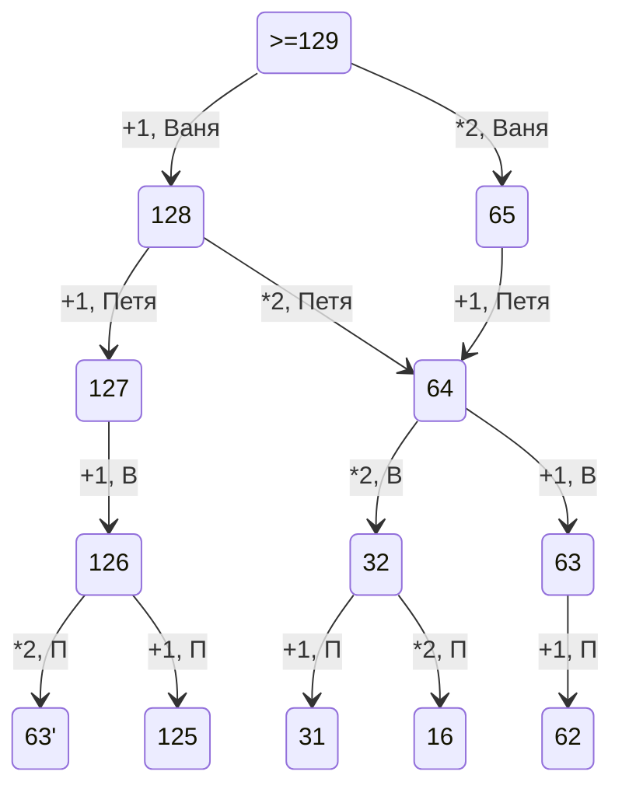

# Шаманина122

## [сайт с доской miro с блок-схемой](https://shhamann.github.io/)

# Аккаунты
[wordpress](https://wordpress.com/home/shaman104947672.wordpress.com)

[Codepen](https://codepen.io/Shhamann)

# Файлы

[сборник программ на решение задач (код Хемминга, перевод числа в 10-ую систему счисления и из 10-ой в другую, перевод слова с помощью азбуки морзе, таблица умножения чисел в различных системах счисления)](https://github.com/Shhamann/11/blob/main/%D0%B7%D0%B0%D0%B4%D0%B0%D1%87%D0%B8.py)

[викторинa](https://github.com/Shhamann/11/blob/main/vikt.py)

[Задача. Буливое вражение](https://github.com/Shhamann/11/blob/main/%D0%BB%D0%BE%D0%B3%D0%B8%D0%BA%D0%B0.py)

[таблица умножения на pyton](https://github.com/Shhamann/11/blob/main/table.py)

[третье задание ЕГЭ демоверсия](https://github.com/Shhamann/11/blob/main/3.xlsx)

[перевод в десятичную СС на pyton](https://github.com/Shhamann/11/blob/main/17_09.py)

[команды sql](https://github.com/Shhamann/11/blob/main/sql)

[пробная программа в Юпитере](https://github.com/Shhamann/11/blob/main/11.ipynb)

[Таблица истинности excel](https://github.com/Shhamann/11/blob/main/%D1%82%D0%B0%D0%B1%D0%BB%20%D0%B8%D1%81%D1%82%D0%B8%D0%BD%D0%BE%D1%81%D1%82%D0%B8.xlsx)

[BDTEST](https://github.com/Shhamann/11/blob/main/bdtest.py)

[КОД ХЭММИНГА](https://github.com/Shhamann/11/blob/main/08.10.ipynb)

[ОТВЕТЫ ДЕМО ЕГЭ](https://github.com/Shhamann/11/blob/main/%D0%B5%D0%B3%D1%8D%20%D0%B4%D0%B5%D0%BC%D0%BE%20%D0%BE%D1%82%D0%B2%D0%B5%D1%82%D1%8B)

[МОРЗЕ EXCEL](https://github.com/Shhamann/11/blob/main/%D0%BC%D0%BE%D1%80%D0%B7%D0%B5.xlsx)

[ТАБЛИЦЫ EXCEL СТР. 40 И 50](https://github.com/Shhamann/11/blob/main/%D1%8140%2C%D1%8150.xlsx)

[Программа перевода по коду Хэмминга](https://github.com/Shhamann/11/blob/main/08.10.ipynb)

# Latex формулы
$$ A \wedge  B = B \wedge  A $$

 $$ \bar{A} \wedge \bar{B} = \bar{B} \wedge  \bar{A} $$
 
 
 
 $$ \overline{\sum_{1}^{2}}=\sqrt{\frac{F a^{x-1}}{(x-1)\cdot x}}+\alpha_{1}^{\frac{1}{3}}+\beta_{2}^{\frac{2}{3}} $$
 
 $$ F=\frac{G\cdot m_{1}\cdot m_{2}}{R^{2}} $$
 
 $$ S=\upsilon_{0}t+\frac{a\cdot t^{2}}{2} $$
 
 $$ a=\frac{\upsilon_{1}-\upsilon_{0}}{t} $$
 

| Задача | Готовность | Программируемая |
| ------ | ------ | ------ |
| 1 | 58 | нет |
| 2 |  |  |
| 3 |  |  |
| 4 |  |  |
| 5 |  |  |
| 6 |  |  |
| 7 |  |  |
| 8 |  |  |
| 9 |  |  |
| 10 | 45 | нет |
| 11 |  |  |
| 12 |  |  |
| 13 |  |  |
|  |  |  |
|  |  |  |
|  |  |  |
|  |  |  |
| 19 | 64 |  |
| 20 | 3263 |  |
| 21 | 62 |  |
|  |  |  |
|  |  |  |
|  |  |  |
|  |  |  |
|  |  |  |
|  |  |  |
|  |  |  |
|  |  |  |

